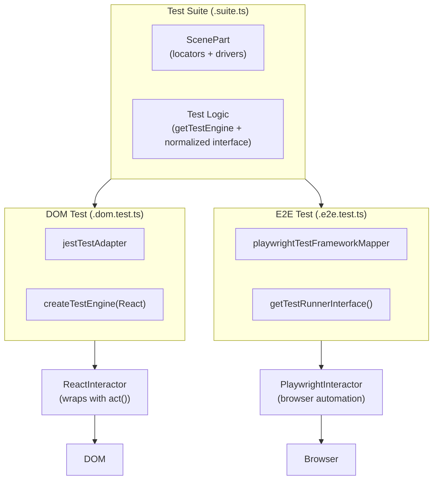

# CLAUDE.md

## Project Overview

**Atomic Testing** - A portable UI testing library using the "component driver" pattern. Provides consistent APIs for testing across React, Vue, Playwright, and DOM environments.

## Commands

```bash
pnpm install                    # Install dependencies (Node.js >=22.12, pnpm >=10)
pnpm run check:type             # Type check all packages
pnpm run check:lint             # ESLint with auto-fix
pnpm test:dom                   # Jest tests (in package directory)
pnpm test:e2e                   # Playwright tests (requires dev server running)
pnpm run build                  # Build package with tsdown
cd docs && pnpm build           # Build documentation (test before doc PRs)
```

### Running E2E Tests

E2E tests require the dev server to be running first:

```bash
cd package-tests/component-driver-html-test
pnpm start &                    # Start Vite dev server in background
pnpm test:e2e                   # Run tests on all browsers (Chrome, Firefox, WebKit)
pnpm test:e2e:chrome            # Run Chrome only (faster iteration)
```

**Cross-browser notes**:

- Mouse events (hover, mouseOut) may behave differently across browsers
- Click coordinates can have sub-pixel offsets (~0.6px) - use tolerance-based comparisons
- Always test all browsers before merging (`pnpm test:e2e`)

## Architecture

### Layer Stack

```text
TestEngine           → Root orchestrator, creates test context
    ↓
ComponentDriver      → Semantic API (click, setValue, getText)
    ↓
Interactor           → Environment adapter (React/Vue/Playwright/DOM)
    ↓
PartLocator          → CSS-based element selection
```

### Interactor Hierarchy

```text
Interactor (interface)     ← packages/core/src/interactor/Interactor.ts
    ↑
DOMInteractor              ← packages/dom-core/src/DOMInteractor.ts
    ↑
├── ReactInteractor        ← packages/react-core/ (wraps in act())
├── VueInteractor          ← packages/vue-3/ (calls nextTick())
└── PlaywrightInteractor   ← packages/playwright/ (browser automation)
```

**Key insight**: ReactInteractor and VueInteractor extend DOMInteractor and wrap all methods to handle framework reactivity (React's `act()`, Vue's `nextTick()`).

### Core Type System (`packages/core/src/partTypes.ts`)

```typescript
// Scene Part Definition - declares UI structure
const parts = {
  email: { locator: byDataTestId('email'), driver: HTMLTextInputDriver },
  submit: { locator: byDataTestId('submit'), driver: HTMLButtonDriver },
} satisfies ScenePart;

// ComponentDriver<T> - T is the ScenePart defining child parts
// IInputDriver<V> - interface for getValue()/setValue() on form elements
```

**Type notes**: Some `any` types in `ComponentDriverClass<T extends ComponentDriver<any>>` are intentional for TypeScript variance reasons - they allow concrete driver classes to be passed as generic parameters.

### Driver Types

| Type                     | Purpose                      | Example       |
| ------------------------ | ---------------------------- | ------------- |
| `ComponentDriver<T>`     | Base driver with child parts | Most drivers  |
| `ContainerDriver<C,T>`   | Driver with dynamic content  | Modal, Dialog |
| `ListComponentDriver<I>` | Driver for lists of items    | Menu, List    |

## Package Structure

```text
packages/
├── core/                    # Core abstractions, types, utilities
├── dom-core/                # DOMInteractor base implementation
├── react-core/              # ReactInteractor (shared React logic)
├── react-18/, react-19/     # Version-specific createTestEngine
├── vue-3/                   # VueInteractor + createTestEngine
├── playwright/              # PlaywrightInteractor
├── component-driver-html/   # HTML element drivers
└── component-driver-mui-*/  # Material-UI drivers

package-tests/               # Test suites validating drivers
├── component-driver-*-test/ # *.dom.test.ts + *.e2e.test.ts
```

## Key Files

| File                                  | Purpose                               |
| ------------------------------------- | ------------------------------------- |
| `core/src/drivers/ComponentDriver.ts` | Base driver class                     |
| `core/src/interactor/Interactor.ts`   | Interactor interface                  |
| `core/src/partTypes.ts`               | Type definitions (ScenePart, etc.)    |
| `core/src/locators/`                  | Locator builders (byDataTestId, etc.) |
| `core/src/utils/timingUtil.ts`        | waitUntil with configurable probing   |
| `dom-core/src/DOMInteractor.ts`       | DOM implementation                    |

## Locators

```typescript
byDataTestId('submit'); // data-testid attribute
byAttribute('aria-label', 'X'); // any attribute
byCssSelector('.my-class'); // raw CSS
byValue('option1'); // value attribute
byChecked(true); // checked state
locatorUtil.append(a, b); // chain locators
```

## Creating a Driver

```typescript
export class MyDriver extends ComponentDriver<{}> implements IInputDriver<string> {
  async getValue(): Promise<string | null> {
    return (await this.interactor.getInputValue(this.locator)) ?? null;
  }

  async setValue(value: string): Promise<boolean> {
    await this.interactor.enterText(this.locator, value);
    return true;
  }

  get driverName(): string {
    return 'MyDriver'; // Used in error messages
  }
}
```

## Testing Pattern

### Simple DOM-Only Test

```typescript
// Test file: MyComponent.dom.test.ts
const parts = { input: { locator: byDataTestId('input'), driver: HTMLTextInputDriver } } satisfies ScenePart;

describe('MyComponent', () => {
  let engine: TestEngine<typeof parts>;

  beforeEach(() => {
    engine = createTestEngine(<MyComponent />, parts);
  });

  afterEach(() => engine.cleanUp());

  it('sets value', async () => {
    await engine.parts.input.setValue('test');
    expect(await engine.parts.input.getValue()).toBe('test');
  });
});
```

### Shared Test Pattern (DOM + E2E)

Tests use a three-file pattern enabling the same logic to run in both Jest (DOM) and Playwright (E2E):

| File Pattern    | Purpose                             |
| --------------- | ----------------------------------- |
| `*.suite.ts`    | Framework-agnostic test definitions |
| `*.dom.test.ts` | Jest adapter (renders React in DOM) |
| `*.e2e.test.ts` | Playwright adapter (browser)        |

#### Shared Test Architecture



#### Suite File Structure

```typescript
// src/examples/MyComponent.suite.ts
import { TestSuiteInfo, useTestEngine } from '@atomic-testing/internal-test-runner';

export const scenePart = {
  input: { locator: byDataTestId('input'), driver: HTMLTextInputDriver },
} satisfies ScenePart;

export const testSuite: TestSuiteInfo<typeof scenePart> = {
  title: 'MyComponent',
  url: '/my-component', // E2E navigation target
  tests: (getTestEngine, { describe, test, beforeEach, afterEach, assertEqual }) => {
    describe('MyComponent', () => {
      // useTestEngine handles beforeEach/afterEach setup and cleanup automatically
      const engine = useTestEngine(scenePart, getTestEngine, { beforeEach, afterEach });

      test('sets value', async () => {
        await engine().parts.input.setValue('test');
        assertEqual(await engine().parts.input.getValue(), 'test');
      });
    });
  },
};
```

The `useTestEngine` helper reduces boilerplate by handling:

- Creating the test engine with the correct `page` context (for E2E) or without (for DOM)
- Calling `cleanUp()` in `afterEach`
- Managing the Jest/Playwright callback signature differences internally

#### DOM Test Adapter

```typescript
// __tests__/MyComponent.dom.test.ts
import { testRunner } from '@atomic-testing/internal-test-runner';
import { jestTestAdapter } from '@atomic-testing/internal-test-runner-jest-adapter';
import { createTestEngine } from '@atomic-testing/react-19';

testRunner(testSuite, jestTestAdapter, {
  getTestEngine: (scenePart) => createTestEngine(<MyComponent />, scenePart),
});
```

#### E2E Test Adapter

```typescript
// __tests__/MyComponent.e2e.test.ts
import { testRunner } from '@atomic-testing/internal-test-runner';
import { getTestRunnerInterface, playWrightTestFrameworkMapper } from '@atomic-testing/playwright';

testRunner(testSuite, playWrightTestFrameworkMapper, getTestRunnerInterface());
```

#### Key Packages

| Package                                             | Purpose                                         |
| --------------------------------------------------- | ----------------------------------------------- |
| `@atomic-testing/internal-test-runner`              | `testRunner()`, `useTestEngine()` orchestrator  |
| `@atomic-testing/internal-test-runner-jest-adapter` | Jest adapter (`jestTestAdapter`)                |
| `@atomic-testing/playwright`                        | Playwright adapter + `getTestRunnerInterface()` |

#### Available Assertions

The `TestFrameworkMapper` provides these assertion methods (destructure from the second parameter of `tests`):

| Method              | Usage                                                                 |
| ------------------- | --------------------------------------------------------------------- |
| `assertEqual`       | `assertEqual(actual, expected)`                                       |
| `assertNotEqual`    | `assertNotEqual(actual, expected)`                                    |
| `assertTrue`        | `assertTrue(value)` - asserts value is true                           |
| `assertFalse`       | `assertFalse(value)` - asserts value is false                         |
| `assertApproxEqual` | `assertApproxEqual(actual, expected, tolerance)` - for floating point |
