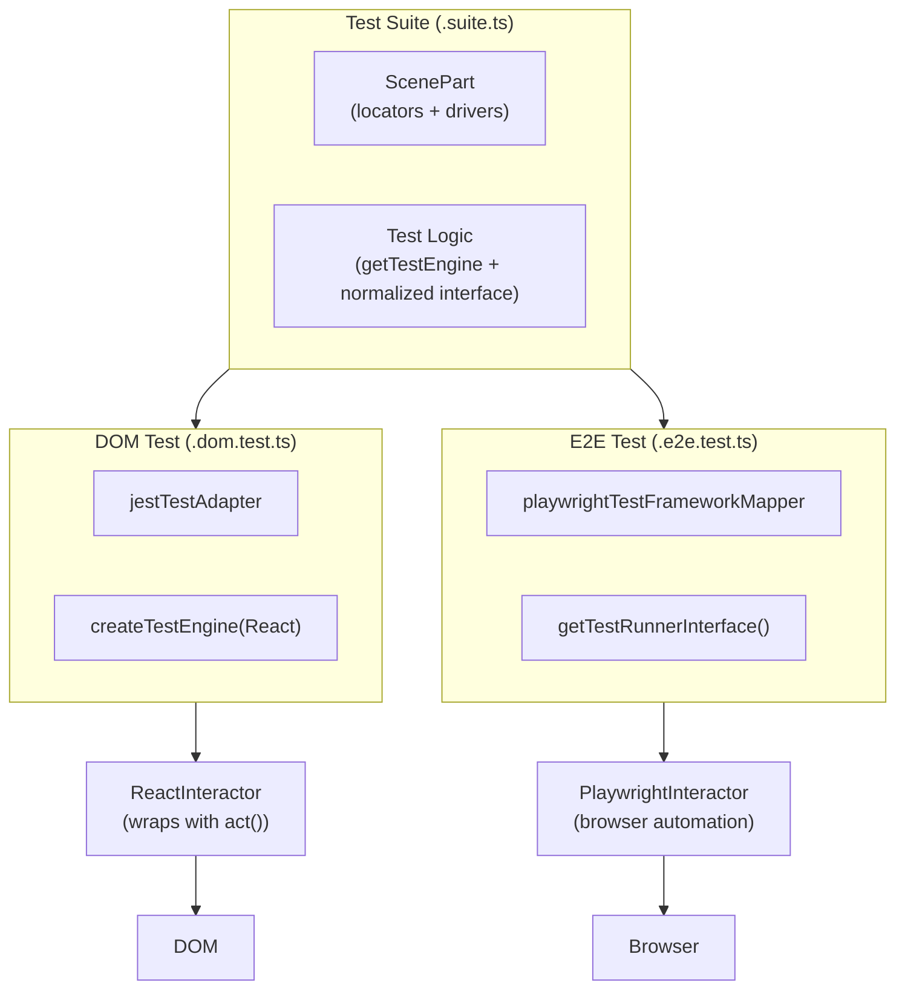

# CLAUDE.md

## Behavioral Rules

**Scrutinize first, build second** — Before any task, surface ambiguities, unstated assumptions, edge cases, and blindspots. Assume as little as possible; don't accept requirements at face value, and never silently pick one of several valid approaches — present tradeoffs with a recommendation.

**Ask in batches of 4** — Surface discovered ambiguities as questions in groups of up to 4. For each question, use whatever format fits best — multiple-choice options when the answer space is enumerable, open-ended when it isn't with AskUserQuestion tool. Keep iterating in rounds of 4 until no ambiguity remains. Use this format:

> Before I start, I want to make sure we're aligned:
>
> 1. **[Topic]** — [Question]
>    - A) [option] — [tradeoff]
>    - B) [option] — [tradeoff]
> 2. **[Topic]** — [Question]
> 3. **[Topic]** — [Open-ended question]

**Keep docs in sync** — If you change code that a doc describes, update the doc. Each package has its own Documentation Freshness Rules — consult the relevant package's `CLAUDE.md` (the docs site's own build and freshness rules live in [`docs/CLAUDE.md`](docs/CLAUDE.md)). And mind the **altitude** when you do: name the concept and point to the canonical symbol — don't transcribe type shapes or constants the code already owns.

### Engineering stance

Default to a **senior engineer**: reason from first principles; favor decoupled, SOLID design; write self-explanatory code (comments explain _why_, not _what_). Keep it **right-sized** — SOLID serves real, present complexity, never speculative abstraction or premature flexibility; if code can be shorter or flatter without losing clarity, rewrite it. Verify against criteria (test / typecheck / lint / observed behavior), not by inspection.

### Scope discipline

Change only what the task needs. **Follow house conventions** (naming, no barrel files, structure, styling); these are not "status quo" to improve. But **don't inherit bad architecture** — coupling, leaky abstractions, duplication, God objects rank below sound design. **Never silently refactor adjacent or out-of-scope code** — surface it instead (below).

_The Engineering stance and Scope discipline above fold in Andrej Karpathy's four LLM-coding principles: think before coding, simplicity first, surgical changes, goal-driven execution._

### Adjacent code-smell protocol

When you spot a code-smell next to your work:

1. Name the better option in a sentence or two — what it is and which SOLID/decoupling principle it serves.
2. Offer a 3-way choice (use the _Ask in batches of 3_ format) and surface it with AskUserQuestion tool:
   - **(a)** Apply it now, in scope.
   - **(b) (recommended)** Apply it now **and** file a tech-debt JIRA for the rest.
   - **(c)** Leave it (status quo).
3. Lean to **(b)** when the fix is real but would balloon the diff. If there's no genuinely better option, say so and move on.

## Project Overview

**Atomic Testing** - A portable UI testing library using the "component driver" pattern. Provides consistent APIs for testing across React, Vue, Playwright, and DOM environments.

## Version control

The local SCM may be **Git, Sapling (`sl`), or any git-compatible system** — this repo currently uses **Sapling**. Two traps to avoid: the environment's `Is a git repository: false` probe is **unreliable** (Sapling reports this; the repo _is_ versioned — detect, don't trust it), and **GitHub operations are SCM-agnostic** — raise issues/PRs/reviews with the authenticated `gh` CLI regardless of the local SCM (pass `-R atomic-testing/atomic-testing`, since `gh` can't infer the repo from a Sapling checkout). **One carve-out:** a PR's _title and description_ are NOT host-side state under Sapling — they derive from the **local commit message, which is their single source of truth**. Set them via `sl metaedit` + `sl pr submit`; never `gh pr edit` for title/body (the next submit regenerates the PR from the commit message and erases any host-side edit). See [`.claude/commands/pr.md`](.claude/commands/pr.md). A SessionStart hook surfaces the active SCM each session. Canonical detection + command map: [`.claude/scm.md`](.claude/scm.md).

## Commands

```bash
pnpm install                    # Install dependencies (Node.js >=22.12, pnpm >=10)
pnpm run check:type             # Type check all packages with tsc (TypeScript 7 native)
pnpm run check:lint             # oxlint with auto-fix (config: .oxlintrc.json)
pnpm run check:style            # Format with oxfmt (JS/TS/JSX/JSON only; .md/.mdx/.css/.yaml left as-is)
pnpm test:dom                   # Jest tests (in package directory)
pnpm test:e2e                   # Playwright tests (requires dev server running)
pnpm run build                  # Build package with tsdown
cd docs && pnpm build           # Build documentation (test before doc PRs)
```

> `docs/` and every `examples/*` app are standalone projects outside the pnpm workspace
> (each `examples/*` app has its own `pnpm-workspace.yaml`, marking it as its own
> workspace root with its own lockfile, and pins `@atomic-testing/*` at published npm
> versions rather than `workspace:*`), so they each need their own install —
> `pnpm run setup` runs all of it (monorepo + `docs/` + every `examples/*` app) in one
> command. The docs API reference also needs the workspace packages built first, so the
> full docs dev loop is `pnpm run setup` then `pnpm run docs:dev` (builds packages,
> starts docs on :3333).

> The documentation site's build (Docusaurus + TypeDoc-generated API reference) and local verification are documented in [`docs/CLAUDE.md`](docs/CLAUDE.md).

> **Toolchain note:** TypeScript 7 and 6 run side by side via the official coexistence recipe (npm aliases). The stable TS 7 native compiler is installed as `@typescript/native` (`npm:typescript@^7.0.2`) and provides the `tsc` binary — used for type-_checking_ (`tsc --noEmit`) **and** the LSP (`tsc --lsp`). Builds, `.d.ts` emit (tsdown), TypeDoc, and api-extractor still need the classic "Strada" programmatic API, which TS 7 native doesn't expose yet — so `typescript` is aliased to `@typescript/typescript6` (classic API, CLI `tsc6`), which those tools import. This replaced the earlier unstable `@typescript/native-preview` (`tsgo`) dev snapshot; a `.pnpmfile.cjs` keeps it from being re-pulled as `rolldown-plugin-dts`'s optional peer. Linting is oxlint (replaced ESLint); formatting is oxfmt (replaced Prettier + `@trivago/prettier-plugin-sort-imports`).

**Build before you test (stale-`dist` trap):** every test runner resolves
`@atomic-testing/*` imports to that package's built **`dist`**, never its `src` —
jest via `moduleNameMapper` (see [`jest.config.base.js`](jest.config.base.js)),
Vite/Playwright via the package's `exports`. So a source edit is invisible both to
the package's own `test:dom`/`test:e2e` **and** to any other package's tests that
import it, until you `pnpm run build` that package **and every changed dependency**
(most often `core`). A stale `dist` silently runs the _old_ code with no error — a
real trap when verifying a fix: e.g. an out-of-date `core` kept a `childListHelper`
enumeration that stopped at the first non-matching child, truncating list counts so
a green test was meaningless. Rebuild the touched packages (and `core`) before
trusting any dom/e2e result. (`tsc` also reads the stale `.d.ts`, so cross-package
typecheck errors that name newly-added exports usually just mean "rebuild," not a
real bug.)

**Shared-primitive blast radius (re-verify consumers, not just what you touched):**
a change to a method on `Interactor` / `DOMInteractor` — or any base every driver
inherits — changes behavior for **every** consumer, not the driver that motivated it.
A picker-motivated tweak to `pressKey` (routing focused presses through
`userEvent.keyboard` for input-event fidelity) silently broke Angular Material
`MatSelect` (open-on-`Enter`) and `MatAutocomplete` (close-on-`Escape`), because
`userEvent.keyboard` delivers to `document.activeElement` where those handlers expect
a direct `fireEvent.keyDown`. Before trusting such a change:

- **Grep every call site** across `packages/` and reason about each — the caller you
  are _not_ looking at is the one that breaks. Prefer to **gate the new behavior to
  exactly the case that needs it** (a condition on the target, an opt-in option) over
  changing the default path for existing callers.
- **Run the full suites of the affected consumer packages**, not just the one you
  edited. A name-filtered run (`jest Foo`, `vitest run Foo`) verifies a _subset_ — a
  `MatAutocomplete` break sat in the same package whose `Select` suite was green.
  **Per-major variants** (`-v20`/`-v21`/`-v22`, `-x-v6/7/8/9`) are **separate CI jobs**;
  verifying one is not verifying the rest.
- Angular Material suites are **browser-mode** and runnable locally —
  `CHROMIUM_EXECUTABLE=/opt/pw-browsers/chromium npx vitest run` — so there's no excuse
  for letting CI be the first place they run.
- When a **rebase auto-merges an interactor override** onto an evolved base, a clean
  merge can still be stale-patterned (a `typeText` override kept plain `act()` after
  main moved to `runUserEvent`); reconcile overrides against their current sibling
  methods.

### Running E2E Tests

E2E tests require the dev server (rebuild the driver packages first — see the
stale-`dist` trap above; the served examples come from `src`, but the drivers they
import come from `dist`). The `component-driver-astryx-test` Playwright config
auto-starts/stops the server itself; other packages start it manually:

```bash
cd package-tests/component-driver-html-test
pnpm start &                    # Start Vite dev server in background
pnpm test:e2e                   # Run tests on all browsers (Chrome, Firefox, WebKit)
pnpm test:e2e:chrome            # Run Chrome only (faster iteration)
```

**Cross-browser notes**:

- Mouse events (hover, mouseOut) may behave differently across browsers
- Click coordinates can have sub-pixel offsets (~0.6px) - use tolerance-based comparisons
- Always test all browsers before merging (`pnpm test:e2e`)

## Code intelligence (tsc LSP)

Claude Code can drive **`tsc --lsp`** (the TypeScript 7 native language server this repo
already typechecks with — `tsc` is `@typescript/native`; see the Toolchain note) for
go-to-definition, find-references, and live diagnostics — navigation backed by the same
engine as `check:type`, not the classic `typescript-language-server` (which can't bind to
the TS 7 native compiler). The repo-local plugin, the Cloud
VM enablement (setup script / SessionStart hook, both idempotent via `enable.sh`), the
reproducible acceptance test, and the cross-package-navigation limitation live in
[`tools/ts7-lsp/README.md`](tools/ts7-lsp/README.md). Two load-bearing facts from there:
cross-package jumps need `dist` **built** (the same stale-`dist` trap above), and
`declarationMap` is a **no-op** for upgrading them (tsdown's bundler emits no declaration
maps). Cross-package **go-to-definition** resolves into the bundled `.d.ts` rather than
source; the `paths→src` fix and why it was **deferred** (it can't be scoped away from
`check:type`), plus the concrete options for a future revisit, are recorded in
[ADR-016](agent-docs/adr/016-defer-paths-src-cross-package-navigation.md).

## Architecture

### Layer Stack

```text
TestEngine           → Root orchestrator, creates test context
    ↓
ComponentDriver      → Semantic API (click, setValue, getText)
    ↓
Interactor           → Environment adapter (React/Vue/Playwright/DOM)
    ↓
PartLocator          → CSS-based element selection
```

### Interactor Hierarchy

```text
Interactor (interface)     ← packages/core/src/interactor/Interactor.ts
    ↑
DOMInteractor              ← packages/dom-core/src/DOMInteractor.ts
    ↑
├── ReactInteractor        ← packages/react-core/ (wraps in act())
├── VueInteractor          ← packages/vue-3/ (calls nextTick())
└── PlaywrightInteractor   ← packages/playwright/ (browser automation)
```

**Key insight**: ReactInteractor and VueInteractor extend DOMInteractor and wrap all methods to handle framework reactivity (React's `act()`, Vue's `nextTick()`).

### Core Type System (`packages/core/src/partTypes.ts`)

```typescript
// Scene Part Definition - declares UI structure
const parts = {
  email: { locator: byDataTestId('email'), driver: HTMLTextInputDriver },
  submit: { locator: byDataTestId('submit'), driver: HTMLButtonDriver },
} satisfies ScenePart;

// ComponentDriver<T> - T is the ScenePart defining child parts
// IInputDriver<V> - interface for getValue()/setValue() on form elements
```

**Type notes**: Some `any` types in `ComponentDriverClass<T extends ComponentDriver<any>>` are intentional for TypeScript variance reasons - they allow concrete driver classes to be passed as generic parameters.

### Driver Types

| Type                     | Purpose                      | Example       |
| ------------------------ | ---------------------------- | ------------- |
| `ComponentDriver<T>`     | Base driver with child parts | Most drivers  |
| `ContainerDriver<C,T>`   | Driver with dynamic content  | Modal, Dialog |
| `ListComponentDriver<I>` | Driver for lists of items    | Menu, List    |

## Package Structure

```text
packages/
├── core/                    # Core abstractions, types, utilities
├── dom-core/                # DOMInteractor base implementation
├── react-core/              # ReactInteractor (shared React logic)
├── react-18/, react-19/     # Version-specific createTestEngine
├── vue-3/                   # VueInteractor + createTestEngine
├── angular-core/            # AngularInteractor + async createTestEngine (ADR-013)
├── angular-20|21|22/        # Thin per-major Angular peer-range packages
├── playwright/              # PlaywrightInteractor
├── storybook/               # StorybookInteractor + play helpers (Storybook 10)
├── component-driver-html/   # HTML element drivers
├── component-driver-mui-*/  # Material-UI drivers
├── component-driver-angular-material-*/ # Angular Material drivers (per major)
└── component-driver-primevue-v4/ # PrimeVue 4 drivers (first Vue 3 design-system package)

package-tests/               # Test suites validating drivers
├── component-driver-*-test/ # *.dom.test.ts + *.e2e.test.ts
```

## Key Files

| File                                  | Purpose                               |
| ------------------------------------- | ------------------------------------- |
| `core/src/drivers/ComponentDriver.ts` | Base driver class                     |
| `core/src/interactor/Interactor.ts`   | Interactor interface                  |
| `core/src/partTypes.ts`               | Type definitions (ScenePart, etc.)    |
| `core/src/locators/`                  | Locator builders (byDataTestId, etc.) |
| `core/src/utils/timingUtil.ts`        | waitUntil with configurable probing   |
| `dom-core/src/DOMInteractor.ts`       | DOM implementation                    |

## Locators

```typescript
byDataTestId('submit'); // data-testid attribute
byAttribute('aria-label', 'X'); // any attribute
byCssSelector('.my-class'); // raw CSS
byValue('option1'); // value attribute
byChecked(true); // checked state
locatorUtil.append(a, b); // chain locators
```

## Creating a Driver

```typescript
export class MyDriver extends ComponentDriver<{}> implements IInputDriver<string> {
  async getValue(): Promise<string | null> {
    return (await this.interactor.getInputValue(this.locator)) ?? null;
  }

  async setValue(value: string): Promise<boolean> {
    await this.interactor.enterText(this.locator, value);
    return true;
  }

  get driverName(): string {
    return 'MyDriver'; // Used in error messages
  }
}
```

> **Shipping a new component-driver _package_ (a new design system) or a framework engine?** Register it with the scaffolder so `create atomic-testing` offers it and it shows up in the generated **Framework & Runner Support** matrix (that matrix is derived from the same registry): add or extend a plugin in `packages/create-atomic-testing/src/registry/` (`designSystems.ts` / `frameworks.ts`) plus a `compatibility.ts` row. The `check:coverage` (COV-\*) CI gate fails if a shipped `component-driver-*` package isn't registered. Details: [`packages/create-atomic-testing/CLAUDE.md`](packages/create-atomic-testing/CLAUDE.md).

## Testing Pattern

### Simple DOM-Only Test

```typescript
// Test file: MyComponent.dom.test.ts
const parts = { input: { locator: byDataTestId('input'), driver: HTMLTextInputDriver } } satisfies ScenePart;

describe('MyComponent', () => {
  let engine: TestEngine<typeof parts>;

  beforeEach(() => {
    engine = createTestEngine(<MyComponent />, parts);
  });

  afterEach(() => engine.cleanUp());

  it('sets value', async () => {
    await engine.parts.input.setValue('test');
    expect(await engine.parts.input.getValue()).toBe('test');
  });
});
```

### Shared Test Pattern (DOM + E2E)

Tests use a three-file pattern enabling the same logic to run in both Jest (DOM) and Playwright (E2E):

| File Pattern    | Purpose                             |
| --------------- | ----------------------------------- |
| `*.suite.ts`    | Framework-agnostic test definitions |
| `*.dom.test.ts` | Jest adapter (renders React in DOM) |
| `*.e2e.test.ts` | Playwright adapter (browser)        |

#### Shared Test Architecture


```mermaid
flowchart TB
    subgraph Suite["Test Suite (.suite.ts)"]
        ScenePart["ScenePart\n(locators + drivers)"]
        TestLogic["Test Logic\n(getTestEngine + normalized interface)"]
    end

    Suite --> DOMTest
    Suite --> E2ETest

    subgraph DOMTest["DOM Test (.dom.test.ts)"]
        JestAdapter["jestTestAdapter"]
        ReactEngine["createTestEngine(React)"]
    end

    subgraph E2ETest["E2E Test (.e2e.test.ts)"]
        PWAdapter["playwrightTestFrameworkMapper"]
        PWEngine["getTestRunnerInterface()"]
    end

    DOMTest --> ReactInteractor["ReactInteractor\n(wraps with act())"]
    E2ETest --> PWInteractor["PlaywrightInteractor\n(browser automation)"]

    ReactInteractor --> DOM["DOM"]
    PWInteractor --> Browser["Browser"]
```

#### Suite File Structure

```typescript
// src/examples/MyComponent.suite.ts
import { TestSuiteInfo, useTestEngine } from '@atomic-testing/internal-test-runner';

export const scenePart = {
  input: { locator: byDataTestId('input'), driver: HTMLTextInputDriver },
} satisfies ScenePart;

export const testSuite: TestSuiteInfo<typeof scenePart> = {
  title: 'MyComponent',
  url: '/my-component', // E2E navigation target
  tests: (getTestEngine, { describe, test, beforeEach, afterEach, assertEqual }) => {
    describe('MyComponent', () => {
      // useTestEngine handles beforeEach/afterEach setup and cleanup automatically
      const engine = useTestEngine(scenePart, getTestEngine, { beforeEach, afterEach });

      test('sets value', async () => {
        await engine().parts.input.setValue('test');
        assertEqual(await engine().parts.input.getValue(), 'test');
      });
    });
  },
};
```

The `useTestEngine` helper reduces boilerplate by handling:

- Creating the test engine with the correct `page` context (for E2E) or without (for DOM)
- Calling `cleanUp()` in `afterEach`
- Managing the Jest/Playwright callback signature differences internally

#### DOM Test Adapter

```typescript
// __tests__/MyComponent.dom.test.ts
import { testRunner } from '@atomic-testing/internal-test-runner';
import { jestTestAdapter } from '@atomic-testing/internal-test-runner-jest-adapter';
import { createTestEngine } from '@atomic-testing/react-19';

testRunner(testSuite, jestTestAdapter, {
  getTestEngine: (scenePart) => createTestEngine(<MyComponent />, scenePart),
});
```

#### E2E Test Adapter

```typescript
// __tests__/MyComponent.e2e.test.ts
import { testRunner } from '@atomic-testing/internal-test-runner';
import {
  getTestRunnerInterface,
  playWrightTestFrameworkMapper,
} from '@atomic-testing/internal-test-runner-playwright-adapter';

testRunner(testSuite, playWrightTestFrameworkMapper, getTestRunnerInterface());
```

#### Key Packages

| Package                                                   | Purpose                                                                                 |
| --------------------------------------------------------- | --------------------------------------------------------------------------------------- |
| `@atomic-testing/internal-test-runner`                    | `testRunner()`, `useTestEngine()` orchestrator                                          |
| `@atomic-testing/internal-test-runner-jest-adapter`       | Jest adapter (`jestTestAdapter`)                                                        |
| `@atomic-testing/internal-test-runner-playwright-adapter` | Playwright test-runner glue (`getTestRunnerInterface`, `playWrightTestFrameworkMapper`) |
| `@atomic-testing/playwright`                              | Browser driver (`PlaywrightInteractor`, `createTestEngine`)                             |

#### Available Assertions

The `TestFrameworkMapper` provides these assertion methods (destructure from the second parameter of `tests`):

| Method              | Usage                                                                 |
| ------------------- | --------------------------------------------------------------------- |
| `assertEqual`       | `assertEqual(actual, expected)`                                       |
| `assertNotEqual`    | `assertNotEqual(actual, expected)`                                    |
| `assertTrue`        | `assertTrue(value)` - asserts value is true                           |
| `assertFalse`       | `assertFalse(value)` - asserts value is false                         |
| `assertApproxEqual` | `assertApproxEqual(actual, expected, tolerance)` - for floating point |
