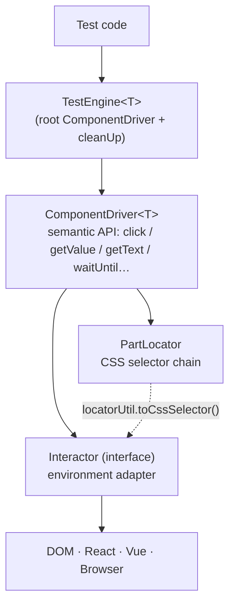
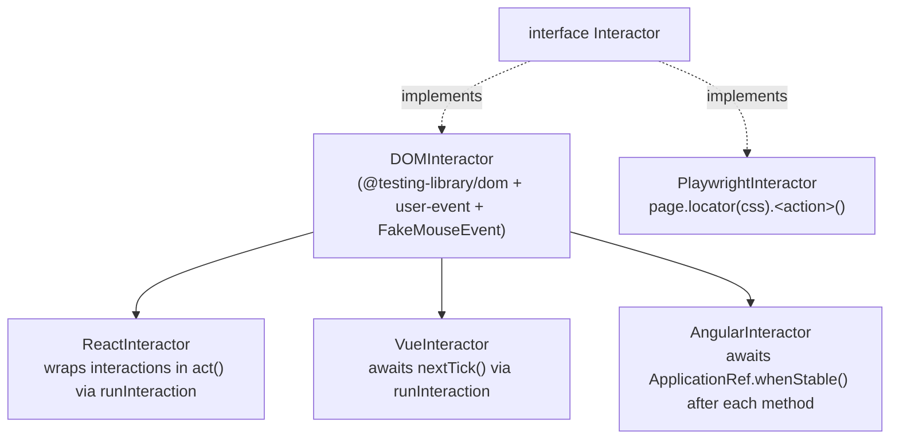
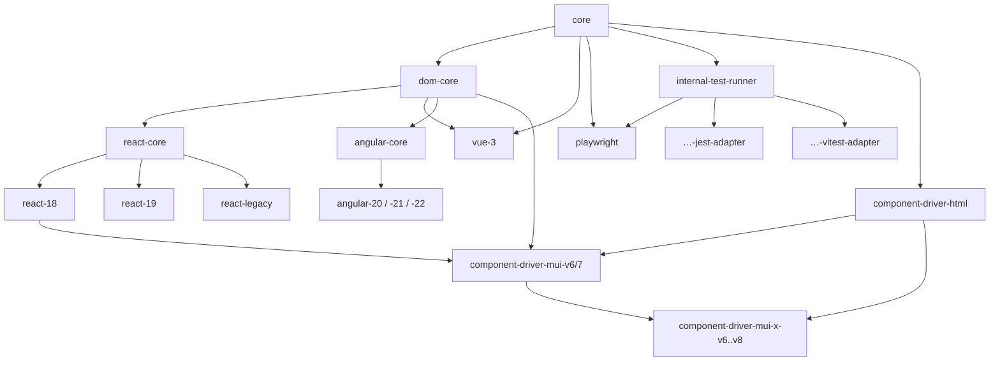
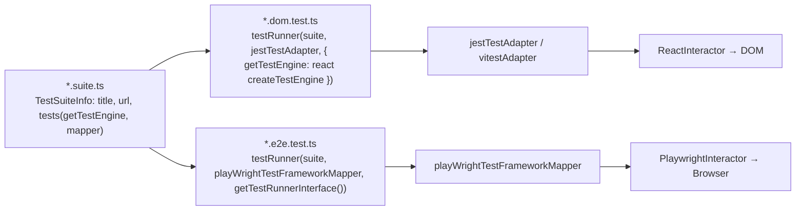

# Atomic Testing — Architecture

How the pieces connect at runtime. Terms are defined in [DOMAIN.md](DOMAIN.md). Source citations point at `../packages/...`.

## Entry points

A test always starts by building a `TestEngine` with an environment-specific factory. All factories produce the same `TestEngine<T>` type; they differ only in which `Interactor` they inject and how they render/clean up.

| Factory                                          | Environment                                          | Interactor injected                   | File                                                                                                                 |
| ------------------------------------------------ | ---------------------------------------------------- | ------------------------------------- | -------------------------------------------------------------------------------------------------------------------- |
| `createDomTestEngine(element, parts)`            | Raw DOM (pre-rendered)                               | `DOMInteractor`                       | [dom-core/createDomTestEngine.ts](../packages/dom-core/src/createDomTestEngine.ts#L13)                               |
| `createTestEngine(node, parts, opt?)`            | React 18 / 19                                        | `ReactInteractor` (`createRoot`)      | [react-18/createTestEngine.ts](../packages/react-18/src/createTestEngine.ts#L25)                                     |
| `createTestEngine(node, parts, opt?)`            | React ≤17                                            | `ReactInteractor` (`ReactDOM.render`) | [react-legacy/createTestEngine.ts](../packages/react-legacy/src/createTestEngine.ts#L25)                             |
| `createTestEngine(component, parts, opt?)`       | Vue 3                                                | `VueInteractor`                       | [vue-3/createTestEngine.ts](../packages/vue-3/src/createTestEngine.ts#L50)                                           |
| `await createTestEngine(component, parts, opt?)` | Angular 20–22 (via `angular-20/-21/-22`)             | `AngularInteractor`                   | [angular-core/createTestEngine.ts](../packages/angular-core/src/createTestEngine.ts)                                 |
| `createTestEngine(page, parts)`                  | Playwright (browser)                                 | `PlaywrightInteractor`                | [playwright/createTestEngine.ts](../packages/playwright/src/createTestEngine.ts#L14)                                 |
| `createRenderedTestEngine(rootEl, parts)`        | React/Vue/Angular, already rendered (e.g. Storybook) | React/Vue/Angular interactor          | [react-18](../packages/react-18/src/createTestEngine.ts#L65), [vue-3](../packages/vue-3/src/createTestEngine.ts#L98) |

The Angular factory is the one **async** variant — Angular's bootstrap API is a promise, so `createTestEngine` returns `Promise<TestEngine<T>>` (see [ADR-013](adr/013-angular-shared-core-thin-packages.md)).

`TestEngine`'s constructor is `(locator, interactor, option?, cleanUp?)` ([TestEngine.ts#L23-L31](../packages/core/src/TestEngine.ts#L23-L31)). DOM/Playwright engines use an empty `[]` root locator; React/Vue engines tag their mount container with a `data-*` attribute and use `byAttribute(...)` as the root.

## Layer stack

A driver never touches the environment directly — it delegates every action to its injected `Interactor`, passing a `PartLocator`. The interactor resolves the locator to a runtime CSS selector via `locatorUtil.toCssSelector(locator, this)` and acts on it ([ComponentDriver.ts#L138-L251](../packages/core/src/drivers/ComponentDriver.ts#L138-L251), [DOMInteractor.ts#L379-L391](../packages/dom-core/src/DOMInteractor.ts#L379-L391)).

### Part tree construction

When a driver is constructed, `getPartFromDefinition` walks its `ScenePart` and instantiates a child driver per entry, chaining each child's locator onto the parent's ([driverUtil.ts](../packages/core/src/drivers/driverUtil.ts#L7-L48)):

1. `locatorContext = driver.prototype.overriddenParentLocator() ?? parentLocator` — lets portal components escape their parent.
2. `actualLocator = overrideLocatorRelativePosition()` applied if the driver overrides it.
3. `componentLocator = locatorUtil.append(locatorContext, actualLocator)`.
4. `new DriverCtor(componentLocator, interactor, option)`.

This is eager and synchronous: the entire driver tree exists after `createTestEngine` returns.

## Interactor inheritance

- **`DOMInteractor`** implements `Interactor` over `@testing-library/dom`'s `fireEvent`, `@testing-library/user-event`, and a `FakeMouseEvent` polyfill (testing-library drops `pageX/pageY`). `getElement` runs `rootEl.querySelector(All)` on the resolved selector ([DOMInteractor.ts#L32-L391](../packages/dom-core/src/DOMInteractor.ts#L32-L391)).
- **`ReactInteractor extends DOMInteractor`** and overrides the single `runInteraction` seam (which every mutating primitive routes through) to wrap the interaction in `act(async () => …)`, flushing React state updates ([ReactInteractor.ts](../packages/react-core/src/ReactInteractor.ts#L4)).
- **`VueInteractor extends DOMInteractor`** and overrides the same `runInteraction` seam to run the interaction then `await nextTick()`, flushing Vue reactivity ([VueInteractor.ts](../packages/vue-3/src/VueInteractor.ts#L4)).
- **`AngularInteractor extends DOMInteractor`** and `override`s each method to call `super.*` then settle on the bootstrapped app's `ApplicationRef.whenStable()` (bounded by a timeout; correct under both zone.js and zoneless change detection). Stability is per-app, so the reference is injected at construction — see [AngularInteractor.ts](../packages/angular-core/src/AngularInteractor.ts) and [ADR-013](adr/013-angular-shared-core-thin-packages.md).
- **`PlaywrightInteractor implements Interactor` directly** — it does **not** extend `DOMInteractor`. Every method resolves the locator to CSS and calls `page.locator(css).<action>()`; Playwright handles waiting/retrying natively, so there is no `act()`/`nextTick()` ([PlaywrightInteractor.ts](../packages/playwright/src/PlaywrightInteractor.ts#L31-L324)). See [ADR-002](adr/002-interactor-abstraction.md).

Key behavior differences to remember:

- React/Vue interactors `clone()` to their own subclass (`new ReactInteractor(this.rootEl)`); the base `rootEl` is `protected` ([DOMInteractor.ts#L33](../packages/dom-core/src/DOMInteractor.ts#L33), [ReactInteractor.ts#L124-L126](../packages/react-core/src/ReactInteractor.ts#L124-L126)).
- `PlaywrightInteractor.isVisible` wraps style reads in try/catch to tolerate elements detaching mid-animation ([PlaywrightInteractor.ts#L259-L297](../packages/playwright/src/PlaywrightInteractor.ts#L259-L297)); `DOMInteractor.isVisible` does not ([DOMInteractor.ts#L456-L478](../packages/dom-core/src/DOMInteractor.ts#L456-L478)).

## createTestEngine variants — what actually differs

| Aspect                | react-18 / react-19                             | react-legacy                                  | vue-3                                                                  |
| --------------------- | ----------------------------------------------- | --------------------------------------------- | ---------------------------------------------------------------------- |
| Render API            | `createRoot(container).render(node)` in `act()` | `ReactDOM.render(node, container)` in `act()` | `@testing-library/vue` `render()`, falls back to `createApp().mount()` |
| `act` source          | `@testing-library/react`                        | `react-dom/test-utils`                        | n/a (uses `nextTick`)                                                  |
| Unmount               | `root.unmount()` in `act()`                     | `ReactDOM.unmountComponentAtNode`             | `renderResult.unmount()` / `app.unmount()`                             |
| Root marker attribute | `data-atomic-testing-react`                     | `data-atomic-testing-react-legacy`            | `data-atomic-testing-vue`                                              |
| Input node type       | `ReactNode`                                     | `ReactElement`                                | `Component \| VueSFCLikeComponent`                                     |

`react-18` and `react-19` share one implementation (both target the `createRoot` API): since #1014 it lives in `react-core` ([createTestEngine.ts](../packages/react-core/src/createTestEngine.ts)) and each version package is a thin re-export that exists only to pin its React peer range. See [ADR-003](adr/003-version-specific-packages.md).

The Angular variant lives once in `angular-core` (render via `createApplication` + `ApplicationRef.bootstrap`, unmount via `ApplicationRef.destroy()`, root marker `data-atomic-testing-angular`, input `Type<unknown>`); `angular-20/-21/-22` are pure re-exports that pin peer ranges — the same duplication-free shape #1014 brought to React, see [ADR-013](adr/013-angular-shared-core-thin-packages.md). Option types `IReactTestEngineOption` / `IVueTestEngineOption` both add an optional `rootElement` mount target ([react-core/types.ts](../packages/react-core/src/types.ts#L3), [vue-3/types.ts](../packages/vue-3/src/types.ts#L3)).

## Package dependency graph

Edges are "depends on" (arrow points from dependency to dependent). Notable real edges from `package.json`:

- `component-driver-mui-v7` depends on `react-18` (and `@mui/material@^7`, `component-driver-html`, `core`, `dom-core`) ([mui-v7/package.json#L25-L33](../packages/component-driver-mui-v7/package.json#L25-L33)).
- `component-driver-mui-x-v8` depends on `component-driver-mui-v6` (plus `component-driver-html`, `core`) ([mui-x-v8/package.json#L40-L45](../packages/component-driver-mui-x-v8/package.json#L40-L45)). [inferred] other mui-x versions pair with their contemporaneous mui-v\* package — confirm in each `package.json`.
- `playwright` depends on `core` only; `@playwright/test` is a peer ([playwright/package.json](../packages/playwright/package.json)). Its E2E test-runner glue lives in the workspace-private `internal-test-runner-playwright-adapter` (which depends on `playwright` + `internal-test-runner`), so the published driver never depends on an internal package.

## The shared three-file test pattern

One test suite runs unchanged in Jest (jsdom), Vitest, and Playwright. This is the project's signature pattern (see [ADR-004](adr/004-shared-three-file-test-pattern.md)).

Mechanism:

- **`TestSuiteInfo<T>`** = `{ title?, url, tests(getTestEngine, mapper) }` ([types.ts#L114-L121](../packages/internal-test-runner/src/types.ts#L114-L121)). `url` is where the E2E runner navigates in `beforeEach`; DOM runs ignore it.
- **`testRunner(suite|suites, mapper, interactionInterface)`** wraps each suite in `mapper.describe`, installs a `beforeEach` that detects Jest's done-callback vs Playwright's fixture by inspecting `arguments[0]`, and calls `goto(url)` for E2E interfaces before invoking `suite.tests(getTestEngine, mapper)` ([testRunner.ts](../packages/internal-test-runner/src/testRunner.ts#L7-L50)).
- **`TestFrameworkMapper`** normalizes assertions + lifecycle across runners: `assertEqual/assertNotEqual/assertTrue/assertFalse/assertApproxEqual`, `describe/test/it`, `beforeEach/afterEach/beforeAll/afterAll` ([types.ts#L72-L88](../packages/internal-test-runner/src/types.ts#L72-L88)). Adapters: `jestTestAdapter` (`@jest/globals`), `vitestAdapter` (`vitest`), `playWrightTestFrameworkMapper` (`@playwright/test`).
- **`useTestEngine(scenePart, getTestEngine, { beforeEach, afterEach })`** builds the engine in `beforeEach` (passing `{ page }` for E2E) and calls `cleanUp()` in `afterEach`; returns a getter `engine()` ([useTestEngine.ts](../packages/internal-test-runner/src/useTestEngine.ts#L21-L46)).

See [modules/test-runner.md](modules/test-runner.md) for the worked three-file example and the `CLAUDE.md` quickstart.

## Cross-cutting concerns

- **Reactivity sync** — handled per-environment by the interactor (`act()` / `nextTick()` / Playwright auto-wait), so test code stays identical. See interactor inheritance above.
- **Waiting / timing** — two tools: `waitUntilComponentState` (state-based, throws on timeout) and `waitUntil` (probe-based, returns last value). Probe interval = `timeoutMs / probeCount` (default 10 probes) ([timingUtil.ts#L42-L81](../packages/core/src/utils/timingUtil.ts#L42-L81)).
- **Portal / overlay components** — modeled with `overriddenParentLocator()` + `overrideLocatorRelativePosition()` returning a `Root` locator, e.g. `byRole('presentation', 'Root')` in `MenuDriver`/`DialogDriver` ([MenuDriver.ts#L24-L41](../packages/component-driver-mui-v7/src/components/MenuDriver.ts#L24-L41), [DialogDriver.ts#L25-L44](../packages/component-driver-mui-v7/src/components/DialogDriver.ts#L25-L44)).
- **Error reporting** — failures throw typed errors carrying the locator or driver (see [DOMAIN.md → Failure modes](DOMAIN.md#failure-modes-error-catalog)); `driverName` identifies the offending driver.

## Key design decisions

| Decision                                                 | Rationale                                                  | ADR                                                  |
| -------------------------------------------------------- | ---------------------------------------------------------- | ---------------------------------------------------- |
| Semantic component-driver API over raw queries           | Tests read in domain terms; selectors live in one place    | [ADR-001](adr/001-component-driver-pattern.md)       |
| `Interactor` abstraction                                 | One driver runs across DOM/React/Vue/Playwright            | [ADR-002](adr/002-interactor-abstraction.md)         |
| Version-specific packages (mui-v6/7, react-18/19/legacy) | Isolate framework-major DOM/API differences from consumers | [ADR-003](adr/003-version-specific-packages.md)      |
| Shared `*.suite.ts` + `TestFrameworkMapper`              | Author once, run in Jest/Vitest/Playwright                 | [ADR-004](adr/004-shared-three-file-test-pattern.md) |
