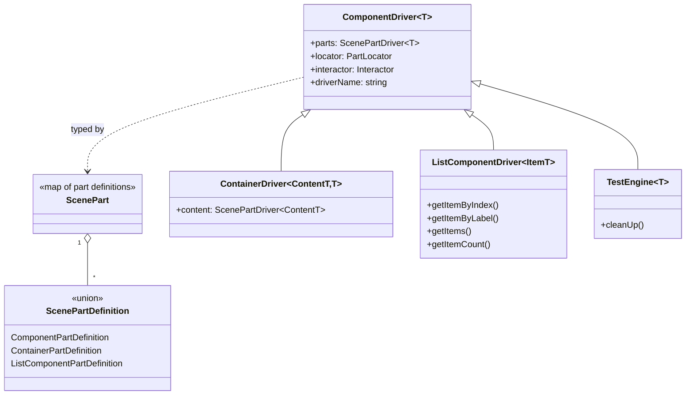

# Atomic Testing — Domain

Vocabulary, type system, and invariants for the `atomic-testing` library. Read this first; every other doc uses these terms. Source citations point at `../packages/...`.

## Glossary

| Term                     | Definition                                                                                                                                                                                      | Code Reference                                                                                                                                       |
| ------------------------ | ----------------------------------------------------------------------------------------------------------------------------------------------------------------------------------------------- | ---------------------------------------------------------------------------------------------------------------------------------------------------- |
| **TestEngine**           | Root driver for a test scene. A `ComponentDriver` plus a `cleanUp()` hook. Created per-environment by a `createTestEngine` factory.                                                             | [TestEngine.ts](../packages/core/src/TestEngine.ts#L12)                                                                                              |
| **ComponentDriver**      | Base class exposing a semantic API (`click`, `getText`, `exists`, `hover`, `waitUntilComponentState`, …) over one component, plus typed access to its child `parts`.                            | [ComponentDriver.ts](../packages/core/src/drivers/ComponentDriver.ts#L25)                                                                            |
| **ContainerDriver**      | A `ComponentDriver` that also exposes `content` parts — for components whose inner DOM is dynamic or portal-rendered (dialogs, popovers).                                                       | [ContainerDriver.ts](../packages/core/src/drivers/ContainerDriver.ts#L13)                                                                            |
| **ListComponentDriver**  | A `ComponentDriver` for repeated, indefinite-length item collections; iterates items by `:nth-of-type`.                                                                                         | [ListComponentDriver.ts](../packages/core/src/drivers/ListComponentDriver.ts#L16)                                                                    |
| **Interactor**           | Environment adapter interface. Performs the low-level actions a driver requests — click, type, key chords, hover, scroll, drag, geometry, file upload — against DOM, React, Vue, or Playwright. | [Interactor.ts](../packages/core/src/interactor/Interactor.ts#L26)                                                                                   |
| **PartLocator**          | How to find an element. Either a single `CssLocator` or a `CssLocator[]` chain.                                                                                                                 | [PartLocator.ts](../packages/core/src/locators/PartLocator.ts)                                                                                       |
| **CssLocator**           | A primitive selector + its relative position (`Root`/`Descendant`/`Same`) + source metadata.                                                                                                    | [CssLocator.ts](../packages/core/src/locators/CssLocator.ts#L13)                                                                                     |
| **LinkedCssLocator**     | Experimental relational locator: match an element by an attribute extracted from another element.                                                                                               | [LinkedCssLocator.ts](../packages/core/src/locators/LinkedCssLocator.ts), [byLinkedElement.ts](../packages/core/src/locators/byLinkedElement.ts#L19) |
| **ScenePart**            | `Record<string, ScenePartDefinition>` — the declarative map of a component's named child parts.                                                                                                 | [partTypes.ts](../packages/core/src/partTypes.ts#L119)                                                                                               |
| **ScenePartDefinition**  | One entry in a `ScenePart`: a `{ locator, driver, option? }` triple (component, container, or list variant).                                                                                    | [partTypes.ts](../packages/core/src/partTypes.ts#L111-L114)                                                                                          |
| **`ScenePartDriver<T>`** | Computed type mapping each part name to its instantiated driver (`InstanceType<T[name]['driver']>`).                                                                                            | [partTypes.ts](../packages/core/src/partTypes.ts#L121-L123)                                                                                          |
| **`IInputDriver<V>`**    | Form-field driver contract: `getValue(): Promise<V>` + `setValue(v): Promise<boolean>`.                                                                                                         | [driverTypes.ts](../packages/core/src/drivers/driverTypes.ts#L7)                                                                                     |
| **driverName**           | Abstract getter every driver implements; a human-readable id used in error messages and debugging.                                                                                              | [ComponentDriver.ts](../packages/core/src/drivers/ComponentDriver.ts#L253)                                                                           |
| **Interactor (clone)**   | Interactors are cloneable (`clone()`), so a driver subtree can be re-bound to a fresh adapter.                                                                                                  | [Interactor.ts](../packages/core/src/interactor/Interactor.ts#L152)                                                                                  |

## Type system

The whole library is organized around one idea: a **ScenePart declares structure**, and a
**driver tree mirrors it**.

- **`ScenePart`** is `Record<string, ScenePartDefinition>` ([partTypes.ts#L119](../packages/core/src/partTypes.ts#L119)). Author scene parts with `satisfies ScenePart` so literal key types are preserved.
- **Three part-definition shapes** ([partTypes.ts#L41-L114](../packages/core/src/partTypes.ts#L41-L114)):
  - `ComponentPartDefinition<T>` — `{ locator, driver, option? }`
  - `ContainerPartDefinition<ContentT, T>` — adds required `content` (nested parts) + `option`
  - `ListComponentPartDefinition<ItemT>` — adds `itemClass` + `itemLocator` via `ListComponentDriverSpecificOption`
- **`ScenePartDriver<T>`** maps part names to driver instances using `InstanceType<T[partName]['driver']>` ([partTypes.ts#L121-L123](../packages/core/src/partTypes.ts#L121-L123)). This is why `engine.parts.email` is typed as the concrete driver you declared.
- **Driver option types**: `IComponentDriverOption<T> = { parts: T }`; `IContainerDriverOption<ContentT,T>` adds `content: ContentT` ([partTypes.ts#L125-L134](../packages/core/src/partTypes.ts#L125-L134)).
- **`ITestEngine<T> extends IComponentDriver<T>`** and adds `cleanUp()` ([partTypes.ts#L183-L185](../packages/core/src/partTypes.ts#L183-L185)).
- **Intentional `any`**: `ComponentDriverClass`/`ComponentDriverCtor` constrain `T extends ComponentDriver<any>` for variance reasons — concrete driver classes must be assignable regardless of their `ScenePart` parameter ([partTypes.ts#L11-L39](../packages/core/src/partTypes.ts#L11-L39)). Do not "fix" these to stricter types.

### Driver contracts (mixins)

Drivers implement small capability interfaces from [driverTypes.ts](../packages/core/src/drivers/driverTypes.ts):

| Interface                  | Members                         | Implemented by (example)                                      |
| -------------------------- | ------------------------------- | ------------------------------------------------------------- |
| `IFormFieldDriver<T>`      | `getValue()`                    | base of input drivers                                         |
| `IInputDriver<T>`          | `getValue()`, `setValue()`      | `HTMLTextInputDriver`, `HTMLSelectDriver`, mui `SelectDriver` |
| `IToggleDriver`            | `isSelected()`, `setSelected()` | checkbox/switch drivers                                       |
| `IClickableDriver`         | `click()`                       | `HTMLButtonDriver`                                            |
| `IMouseInteractableDriver` | `hover()`                       | `HTMLButtonDriver`                                            |

## Locator vocabulary

A `PartLocator` is a `CssLocator` or an array of them ([PartLocator.ts](../packages/core/src/locators/PartLocator.ts)). Each `CssLocator` carries:

- **`selector`** — the raw CSS string.
- **`relative`** — `'Root' | 'Descendant' | 'Same'` ([LocatorRelativePosition.ts](../packages/core/src/locators/LocatorRelativePosition.ts#L4)), default `'Descendant'` ([CssLocator.ts#L14](../packages/core/src/locators/CssLocator.ts#L14)):
  - `Descendant` → element is nested inside the parent (CSS descendant combinator).
  - `Same` → the selector applies to the same element / no descendant hop (e.g. `:checked`, `:nth-of-type(n)`).
  - `Root` → **resets** the chain; selectors from the `Root` element onward are used, ignoring the parent context. Used by portal-rendered components (dialog/menu) to escape their declared parent.
- **`type`** — `'css'` (the only supported `LocatorType` today).
- **`complexity`** — `'primitive'` for `CssLocator`, `'linked'` for `LinkedCssLocator`.

Builders (all in [locators/](../packages/core/src/locators/index.ts)) produce `CssLocator`s — see [modules/core.md](modules/core.md#locators) for the full `by*` catalog.

## Invariants

- **Missing-element actions throw.** Every mutative `DOMInteractor` method (`click`, `enterText`, `focus`, mouse events, `selectOptionValue`) throws `ElementNotFoundError(locator, action)` when the element resolves to `null` ([DOMInteractor.ts#L82-L85](../packages/dom-core/src/DOMInteractor.ts#L82-L85)).
- **`waitUntilComponentState` throws on timeout** (via `interactorUtil.interactorWaitUtil` → `WaitForFailureError`); **`waitUntil` does not** — it returns the last probed value even if the condition never matched ([timingUtil.ts#L42-L81](../packages/core/src/utils/timingUtil.ts#L42-L81)).
- **`enforcePartExistence(names)` throws `MissingPartError`** if any named part is absent from the DOM ([ComponentDriver.ts#L97-L102](../packages/core/src/drivers/ComponentDriver.ts#L97-L102)).
- **Locator-override hooks run before construction.** `overriddenParentLocator()` and `overrideLocatorRelativePosition()` are invoked on `driver.prototype` while building the part tree, so they **must not reference instance state** ([driverUtil.ts#L26-L30](../packages/core/src/drivers/driverUtil.ts#L26-L30), [ComponentDriver.ts#L57-L76](../packages/core/src/drivers/ComponentDriver.ts#L57-L76)).
- **List items are positional.** `ListComponentDriver` / `listHelper` locate the *n*th item with `byCssSelector(':nth-of-type(n)', 'Same')` and stop at the first gap; non-item siblings between items break counting ([listHelper.ts#L21-L79](../packages/core/src/drivers/listHelper.ts#L21-L79)).
- **Default wait** is `{ condition: 'attached', timeoutMs: 30000, debug: false }` ([WaitForOption.ts#L28-L32](../packages/core/src/drivers/WaitForOption.ts#L28-L32)). `waitUntilVisible()` defaults to a 10s timeout ([ComponentDriver.ts#L210](../packages/core/src/drivers/ComponentDriver.ts#L210)).
- **Date-typed inputs are format-validated** before typing. `enterText` on an `<input type=date|datetime-local|time>` validates the string and throws a descriptive `Error` on mismatch ([DOMInteractor.ts#L325-L336](../packages/dom-core/src/DOMInteractor.ts#L325-L336), [dateUtil.ts](../packages/core/src/utils/dateUtil.ts#L86-L105)).

## Failure modes (error catalog)

All errors are exported from [core/src/errors/index.ts](../packages/core/src/errors/index.ts); each has a matching string id constant.

| Error                                             | Thrown when                                                       | Base                                     |
| ------------------------------------------------- | ----------------------------------------------------------------- | ---------------------------------------- |
| `ElementNotFoundError`                            | a mutative interactor action targets a non-existent element       | `InteractorErrorBase` (locator-scoped)   |
| `WaitForFailureError`                             | `waitUntilComponentState` times out before reaching the condition | `InteractorErrorBase`                    |
| `MissingPartError`                                | `enforcePartExistence` finds a declared part absent               | `ErrorBase` (driver-scoped)              |
| `TooManyMatchingElementError`                     | a single-element query matches more than one element              | `ErrorBase`                              |
| `ItemNotFoundError`                               | a list/item lookup fails                                          | `ErrorBase`                              |
| `MenuItemNotFoundError` / `MenuItemDisabledError` | MUI menu/select item missing or disabled                          | `ErrorBase` (in the mui driver packages) |

## See also

- [ARCHITECTURE.md](ARCHITECTURE.md) — how these types connect at runtime (layer stack, interactor inheritance, shared-test pattern).
- [modules/core.md](modules/core.md) — the full export surface and the `by*` locator catalog.
- [adr/001-component-driver-pattern.md](adr/001-component-driver-pattern.md) — why drivers + scene parts.
