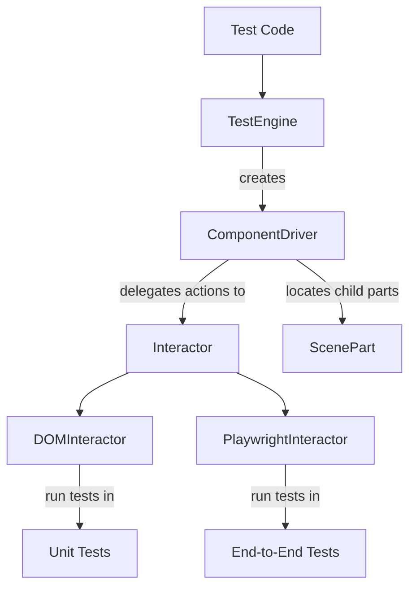

# Architecture

The diagram below shows how the key pieces of Atomic Testing fit together.

Atomic Testing follows a layered design so that your test code stays the same no
matter which rendering library or test runner you use. The main pieces from the
diagram are described below.

## Test Engine

The test engine renders a scene and wires up every component defined in a
`ScenePart`. It exposes these parts through a typed API so tests can interact
with them. Engines exist for React, Vue and other frameworks&mdash;see the
[Setup](../setup.mdx) and [Core Concepts](../core-concepts.mdx#test-engine)
sections for examples.

## Component Drivers

Drivers encapsulate how to operate a component. Rather than querying the DOM in
every test, you call methods such as `click()` or `setValue()` on the driver.
Drivers may also contain child parts, allowing complex widgets to be composed
from simpler ones. The engine instantiates drivers based on the `ScenePart`
definition. Learn how to build your own drivers in
[Build Component Driver](./build-component-driver.mdx).

## ScenePart

`ScenePart` acts as a blueprint describing the parts a scene exposes&mdash;their
locators and which driver class to use. Scene parts can be nested so larger
scenes reuse smaller ones. Refer to the
[Core Concepts](../core-concepts.mdx#scenepart) page for an in-depth look.

## Interactor

Interactors perform the low level actions requested by drivers. `DOMInteractor`
works with `@testing-library` utilities for unit tests while
`PlaywrightInteractor` targets a real browser for end-to-end scenarios. Because
drivers talk only to the interactor interface, the same driver code can operate
in both environments. See the [Interactor](./interactor.mdx) guide for details
on creating custom interactors.

## Putting it all together

When a test calls `engine.parts.button.click()`, the call flows through the
driver into the interactor, which then manipulates the actual UI element. This
indirection keeps tests declarative and portable across environments while still
letting you reuse driver code and scene definitions.
