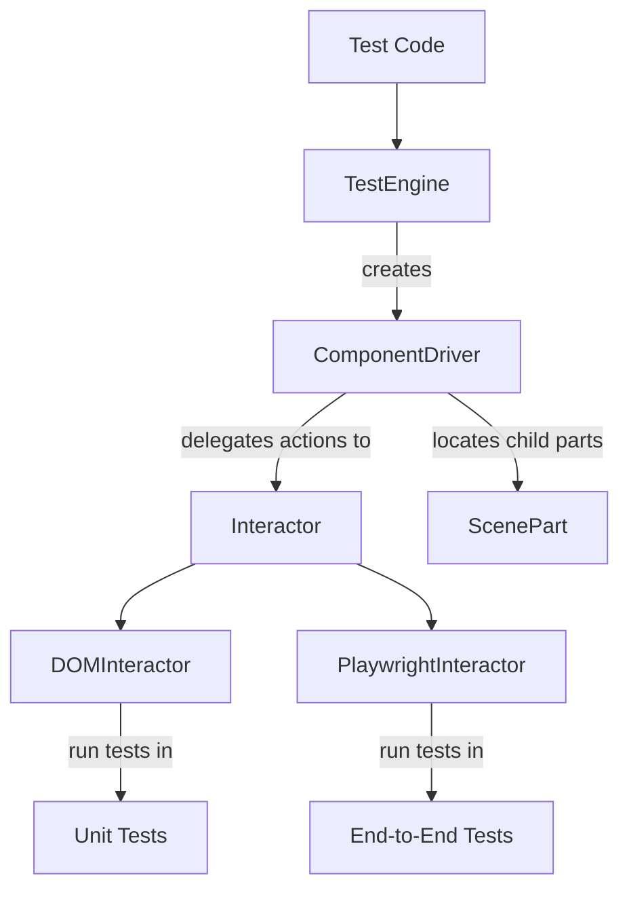

# Architecture

The diagram below shows how the key pieces of Atomic Testing fit together.

```mermaid
flowchart TD
    TestCode[Test Code] --> TestEngine
    TestEngine -->|creates| ComponentDriver
    ComponentDriver -->|delegates actions to| Interactor
    ComponentDriver -->|locates child parts| ScenePart
    Interactor --> DOMInteractor
    Interactor --> PlaywrightInteractor
    DOMInteractor -->|run tests in| UnitTests[Unit Tests]
    PlaywrightInteractor -->|run tests in| e2etests[End-to-End Tests]
```
